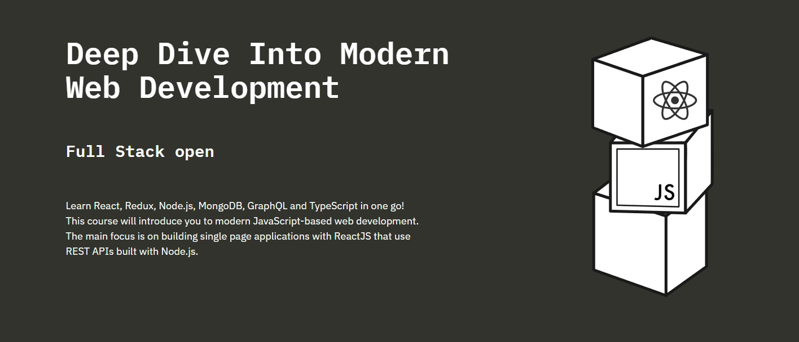

# FullStackOpen Course Submissions



### Exercises and submissions for the FullStackOpen Course.

### FullStackOpen Project Content

```
Part 0 - Fundamentals of Web apps

Part 1 - Introduction to React

Part 2 - Communicating with server

Part 3 - Programming a server with NodeJS and Express

Part 4 - Testing Express servers, user administration

Part 5 - Testing React apps

Part 6 - Advanced state management

Part 7 - React router, custom hooks, styling app with CSS and webpack

Part 8 - GraphQL
```

### More information will be written soon.

Deployed frontend + backend for exercise 3.10 and 3.11 Phonebook step 10: https://fullstackcourse-mpoh.onrender.com/

This repo has a few different branches. The "production" branch is the one that is published into internet. The link is above. Meanwhile "playground" branch contains random code to poke around and play with the available technology. It is also used to follow along the FullStackOpen chapters.

The ideal node express project structure is:

```
├── controllers
│ └── notes.js
├── dist
│ └── ...
├── models
│ └── note.js
├── utils
│ ├── config.js
│ ├── logger.js
│ └── middleware.js
├── app.js
├── index.js
├── package-lock.json
├── package.json
```
